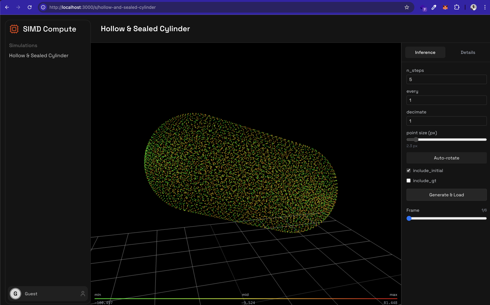

# SIMD: Federated Learning for CFD Simulation

## Project Overview

**SIMD** (Scalable Independent Model Distribution) is a **federated learning system** that enables **collaborative training across distributed data silos** for Computational Fluid Dynamics (CFD) simulation using Graph Neural Networks (GNNs). The project demonstrates how organizations can jointly train models on large-scale scientific datasets without centralizing sensitive or massive simulation data.

Using a MeshGraphNet-style architecture, SIMD predicts fluid dynamics properties (temperature, pressure, and velocity components) across mesh nodes. The **9.6 GB CFD dataset** is partitioned into **40 independent shards**, each representing a separate data silo (e.g., different organizations, simulation labs, or compute clusters). Each shard trains locally on its data partition, then **model weights are averaged** to create a unified global model—embodying true **collaborative learning without data sharing**.

This approach is ideal for large-scale physics simulations where:
- **Data privacy** matters (CFD simulations may be proprietary)
- **Data transfer** is prohibitively expensive (9.6 GB is too large to move repeatedly)
- **Compute resources** are distributed across multiple organizations or clusters
- **Collaborative learning** across silos improves model generalization

**Monitoring Dashboard:** [W&B Project - simd-cfd](https://wandb.ai/simd/simd-cfd/workspace)

## Model Architecture

The model (`simd/model.py`) uses a MeshGraphNet-inspired architecture built with PyTorch Geometric:

- **Input Features:**
  - Node features: `(N, 8)` - `[x, y, z, T, p, u_x, u_y, u_z]` (position, temperature, pressure, velocity)
  - Edge features: `(E, 4)` - `[dx, dy, dz, r]` (relative positions and distance)
  
- **Architecture:**
  - 3 NNConv graph convolutional layers with learned edge networks
  - Hidden dimension: 128
  - Each NNConv layer uses an MLP to generate edge-conditioned weights
  - ReLU activations between layers
  
- **Output:**
  - Node predictions: `(N, 5)` - `[ΔT, Δp, Δu_x, Δu_y, Δu_z]` (normalized deltas)

## Data Handling

The project handles a **9.6 GB CFD dataset** containing timestep snapshots stored as JSON files (`step_*.json`). To enable efficient federated training:

### Two-Level Partitioning

1. **Job-Level Sharding** (across GPU cluster jobs):
   - Dataset is split into 40 shards
   - Each shard contains a contiguous block of timestep files
   - Environment variables: `SIMD_JOB_SHARD_ID` and `SIMD_JOB_NUM_SHARDS`

2. **Client-Level Partitioning** (within each federated learning job):
   - Each shard's data is further partitioned among Flower clients
   - Enables multiple clients to train on subsets within each shard

### Data Structure

Each timestep JSON file contains:
- `node_input`: Node features (coordinates and physical properties)
- `edge_index`: Graph connectivity (2, E)
- `edge_attr`: Edge features (relative geometry)
- `target_delta`: Target changes in physical properties

Normalization statistics (`node_stats.json`, `edge_stats.json`, `target_stats.json`) ensure standardized inputs.

## Training Strategy: Evolution to 40 Shards

We iteratively refined our sharding strategy to optimize for the GPU cluster's constraints (maximum 4 concurrent jobs):

| Shards | Result | Issue |
|--------|--------|-------|
| **4 shards** | ❌ Timeout | Each shard too large, training exceeded cluster time limits |
| **10 shards** | ❌ Timeout | Still too much data per shard, couldn't complete in time |
| **20 shards** | ❌ Timeout | Improved but still hitting time limits |
| **40 shards** | ✅ Success | **~7 min per shard** - Perfect for federated learning! |

**Why 40 shards works:**
- Each shard trains in ~7 minutes on average
- Fits well within cluster job time limits
- Each shard saves its own model checkpoint with its data partition
- Enables efficient parallel training across the cluster
- 4 jobs run concurrently, processing all 40 shards in waves

## Running Training

### Environment Setup

```bash
# Create and activate virtual environment
pyenv virtualenv 3.10.14 simd
pyenv activate simd

# Install dependencies
pip install -e .
```

### Launch Federated Training Across All Shards

The following command submits 40 parallel jobs to the GPU cluster, each training on a different data shard:

```bash
for SHARD in $(seq 0 39); do
  ./submit-job.sh \
    "export CFD_JSON_ROOT=\$HOME/cfd-metadata-json \
     && export SIMD_JOB_SHARD_ID=${SHARD} \
     && export SIMD_JOB_NUM_SHARDS=40 \
     && export SIMD_CHECKPOINT_DIR=\$HOME/simd_checkpoints_wandb/shard${SHARD} \
     && export WANDB_PROJECT=simd-cfd \
     && export WANDB_RUN_GROUP=shard${SHARD} \
     && cd \$HOME/coldstart/simd \
     && flwr run . cluster-gpu" \
    --gpu \
    --name simd-s${SHARD}
done
```

**Environment Variables:**
- `CFD_JSON_ROOT`: Directory containing the JSON dataset
- `SIMD_JOB_SHARD_ID`: Current shard ID (0-39)
- `SIMD_JOB_NUM_SHARDS`: Total number of shards (40)
- `SIMD_CHECKPOINT_DIR`: Where to save model checkpoints per shard
- `WANDB_PROJECT`: Weights & Biases project name
- `WANDB_RUN_GROUP`: W&B group for organizing runs by shard

### How It Works

1. **Job Submission**: The loop submits 40 jobs to the cluster
2. **Concurrent Execution**: Maximum 4 jobs run simultaneously (cluster limit)
3. **Wave Processing**: Jobs execute in waves until all 40 shards complete
4. **Independent Training**: Each shard trains a model on its data partition
5. **Checkpoint Saving**: Each shard saves its trained model independently
6. **Monitoring**: All runs are tracked in W&B for visualization

## Model Aggregation: Averaging Across Shards

After all 40 shards complete training, we perform **federated averaging** to create a unified global model. This is the core of collaborative federated learning—each shard (representing a different data silo/organization) contributes its learned weights, and we compute the average to benefit from knowledge across all data partitions.

### The Averaging Process

The `avg.py` script implements **FedAvg** (Federated Averaging):
1. **Collect checkpoints** from all 40 shard directories
2. **Load each model's state_dict** (weights and biases)
3. **Compute element-wise average** of all parameters
4. **Save the global averaged model** for deployment

This averaging approach:
- ✅ **Preserves privacy**: Raw data never leaves each shard
- ✅ **Leverages all data**: Global model benefits from entire 9.6 GB dataset
- ✅ **Simple and effective**: Equal weighting assumes similar data distributions
- ✅ **Scalable**: Works with any number of shards

### Running Model Averaging

After all training jobs complete, run:

```bash
python avg.py \
  --ckpt-root "$HOME/simd_checkpoints_wandb" \
  --shard-prefix shard \
  --output "$HOME/simd_checkpoints_wandb/global_avg_latest.pt"
```

<details>
<summary><b>Click to see full averaging output (40 shards)</b></summary>

```
[INFO] Found 40 shard checkpoints:
  - /home/team09/simd_checkpoints_wandb/shard0/latest.pt
  - /home/team09/simd_checkpoints_wandb/shard1/latest.pt
  - /home/team09/simd_checkpoints_wandb/shard10/latest.pt
  - /home/team09/simd_checkpoints_wandb/shard11/latest.pt
  - /home/team09/simd_checkpoints_wandb/shard12/latest.pt
  - /home/team09/simd_checkpoints_wandb/shard13/latest.pt
  - /home/team09/simd_checkpoints_wandb/shard14/latest.pt
  - /home/team09/simd_checkpoints_wandb/shard15/latest.pt
  - /home/team09/simd_checkpoints_wandb/shard16/latest.pt
  - /home/team09/simd_checkpoints_wandb/shard17/latest.pt
  - /home/team09/simd_checkpoints_wandb/shard18/latest.pt
  - /home/team09/simd_checkpoints_wandb/shard19/latest.pt
  - /home/team09/simd_checkpoints_wandb/shard2/latest.pt
  - /home/team09/simd_checkpoints_wandb/shard20/latest.pt
  - /home/team09/simd_checkpoints_wandb/shard21/latest.pt
  - /home/team09/simd_checkpoints_wandb/shard22/latest.pt
  - /home/team09/simd_checkpoints_wandb/shard23/latest.pt
  - /home/team09/simd_checkpoints_wandb/shard24/latest.pt
  - /home/team09/simd_checkpoints_wandb/shard25/latest.pt
  - /home/team09/simd_checkpoints_wandb/shard26/latest.pt
  - /home/team09/simd_checkpoints_wandb/shard27/latest.pt
  - /home/team09/simd_checkpoints_wandb/shard28/latest.pt
  - /home/team09/simd_checkpoints_wandb/shard29/latest.pt
  - /home/team09/simd_checkpoints_wandb/shard3/latest.pt
  - /home/team09/simd_checkpoints_wandb/shard30/latest.pt
  - /home/team09/simd_checkpoints_wandb/shard31/latest.pt
  - /home/team09/simd_checkpoints_wandb/shard32/latest.pt
  - /home/team09/simd_checkpoints_wandb/shard33/latest.pt
  - /home/team09/simd_checkpoints_wandb/shard34/latest.pt
  - /home/team09/simd_checkpoints_wandb/shard35/latest.pt
  - /home/team09/simd_checkpoints_wandb/shard36/latest.pt
  - /home/team09/simd_checkpoints_wandb/shard37/latest.pt
  - /home/team09/simd_checkpoints_wandb/shard38/latest.pt
  - /home/team09/simd_checkpoints_wandb/shard39/latest.pt
  - /home/team09/simd_checkpoints_wandb/shard4/latest.pt
  - /home/team09/simd_checkpoints_wandb/shard5/latest.pt
  - /home/team09/simd_checkpoints_wandb/shard6/latest.pt
  - /home/team09/simd_checkpoints_wandb/shard7/latest.pt
  - /home/team09/simd_checkpoints_wandb/shard8/latest.pt
  - /home/team09/simd_checkpoints_wandb/shard9/latest.pt
[INFO] Averaging 40 checkpoints
[INFO] Loading shard 1/40 from /home/team09/simd_checkpoints_wandb/shard0/latest.pt
[INFO] Loading shard 2/40 from /home/team09/simd_checkpoints_wandb/shard1/latest.pt
[INFO] Loading shard 3/40 from /home/team09/simd_checkpoints_wandb/shard10/latest.pt
[INFO] Loading shard 4/40 from /home/team09/simd_checkpoints_wandb/shard11/latest.pt
[INFO] Loading shard 5/40 from /home/team09/simd_checkpoints_wandb/shard12/latest.pt
[INFO] Loading shard 6/40 from /home/team09/simd_checkpoints_wandb/shard13/latest.pt
[INFO] Loading shard 7/40 from /home/team09/simd_checkpoints_wandb/shard14/latest.pt
[INFO] Loading shard 8/40 from /home/team09/simd_checkpoints_wandb/shard15/latest.pt
[INFO] Loading shard 9/40 from /home/team09/simd_checkpoints_wandb/shard16/latest.pt
[INFO] Loading shard 10/40 from /home/team09/simd_checkpoints_wandb/shard17/latest.pt
[INFO] Loading shard 11/40 from /home/team09/simd_checkpoints_wandb/shard18/latest.pt
[INFO] Loading shard 12/40 from /home/team09/simd_checkpoints_wandb/shard19/latest.pt
[INFO] Loading shard 13/40 from /home/team09/simd_checkpoints_wandb/shard2/latest.pt
[INFO] Loading shard 14/40 from /home/team09/simd_checkpoints_wandb/shard20/latest.pt
[INFO] Loading shard 15/40 from /home/team09/simd_checkpoints_wandb/shard21/latest.pt
[INFO] Loading shard 16/40 from /home/team09/simd_checkpoints_wandb/shard22/latest.pt
[INFO] Loading shard 17/40 from /home/team09/simd_checkpoints_wandb/shard23/latest.pt
[INFO] Loading shard 18/40 from /home/team09/simd_checkpoints_wandb/shard24/latest.pt
[INFO] Loading shard 19/40 from /home/team09/simd_checkpoints_wandb/shard25/latest.pt
[INFO] Loading shard 20/40 from /home/team09/simd_checkpoints_wandb/shard26/latest.pt
[INFO] Loading shard 21/40 from /home/team09/simd_checkpoints_wandb/shard27/latest.pt
[INFO] Loading shard 22/40 from /home/team09/simd_checkpoints_wandb/shard28/latest.pt
[INFO] Loading shard 23/40 from /home/team09/simd_checkpoints_wandb/shard29/latest.pt
[INFO] Loading shard 24/40 from /home/team09/simd_checkpoints_wandb/shard3/latest.pt
[INFO] Loading shard 25/40 from /home/team09/simd_checkpoints_wandb/shard30/latest.pt
[INFO] Loading shard 26/40 from /home/team09/simd_checkpoints_wandb/shard31/latest.pt
[INFO] Loading shard 27/40 from /home/team09/simd_checkpoints_wandb/shard32/latest.pt
[INFO] Loading shard 28/40 from /home/team09/simd_checkpoints_wandb/shard33/latest.pt
[INFO] Loading shard 29/40 from /home/team09/simd_checkpoints_wandb/shard34/latest.pt
[INFO] Loading shard 30/40 from /home/team09/simd_checkpoints_wandb/shard35/latest.pt
[INFO] Loading shard 31/40 from /home/team09/simd_checkpoints_wandb/shard36/latest.pt
[INFO] Loading shard 32/40 from /home/team09/simd_checkpoints_wandb/shard37/latest.pt
[INFO] Loading shard 33/40 from /home/team09/simd_checkpoints_wandb/shard38/latest.pt
[INFO] Loading shard 34/40 from /home/team09/simd_checkpoints_wandb/shard39/latest.pt
[INFO] Loading shard 35/40 from /home/team09/simd_checkpoints_wandb/shard4/latest.pt
[INFO] Loading shard 36/40 from /home/team09/simd_checkpoints_wandb/shard5/latest.pt
[INFO] Loading shard 37/40 from /home/team09/simd_checkpoints_wandb/shard6/latest.pt
[INFO] Loading shard 38/40 from /home/team09/simd_checkpoints_wandb/shard7/latest.pt
[INFO] Loading shard 39/40 from /home/team09/simd_checkpoints_wandb/shard8/latest.pt
[INFO] Loading shard 40/40 from /home/team09/simd_checkpoints_wandb/shard9/latest.pt
[DONE] Saved averaged model to: /home/team09/simd_checkpoints_wandb/global_avg_latest.pt
```

</details>

The resulting `global_avg_latest.pt` represents knowledge learned from all 40 data silos, demonstrating successful **collaborative federated learning**.

## Physics-Informed AI Inference & 3D Visualization

Once the global model is trained through federated learning, we use it as a **physics-informed AI surrogate** to run fast CFD simulations. Instead of solving the full Navier-Stokes equations with FEniCSx (which can take hours), the trained GNN model predicts the fluid dynamics in seconds—making it ideal for real-time simulation, design optimization, and interactive exploration.

### Interactive 3D Visualization Frontend

We've built a **web-based 3D visualization tool** that allows users to:
- Load and visualize CFD simulation data as 3D point clouds
- Interact with the mesh geometry (rotate, zoom, auto-rotate)
- Run inference using the trained model
- Visualize temperature, pressure, and velocity fields with color-coded gradients
- Scrub through timesteps to see flow evolution

**Frontend Repository**: [https://github.com/simd-ai/f](https://github.com/simd-ai/f)


*Interactive 3D point cloud visualization of hollow and sealed cylinder CFD simulations. The interface shows the mesh colored by field values (temperature/pressure/velocity) with real-time inference controls.*

This frontend demonstrates the **end-to-end workflow**: from federated training on distributed data silos → model aggregation → fast physics-informed inference → interactive 3D visualization for engineers and researchers.

## Project Structure

```
fed-train/
├── simd/
│   ├── client_app.py     # Flower client implementation
│   ├── server_app.py     # Flower server for aggregation
│   ├── model.py          # GNN model + train/test functions
│   ├── dataset.py        # CFD graph dataset with sharding logic
│   ├── strategy.py       # Federated learning strategy
│   └── utils.py          # Helper utilities
├── avg.py                # FedAvg model aggregation script
├── pyproject.toml        # Project dependencies and config
└── README.md
```

## Results & Monitoring

Track training progress, loss curves, and per-channel MSE metrics (ΔT, Δp, Δu_x, Δu_y, Δu_z) on the W&B dashboard:

**[https://wandb.ai/simd/simd-cfd/workspace](https://wandb.ai/simd/simd-cfd/workspace)**

Each shard's training is logged separately with:
- Training loss and per-channel MSE
- Validation metrics
- System metrics (GPU usage, timing)
- Grouped by shard ID for easy comparison

## Dataset: Hollow and Sealed Cylinder CFD Simulations

We have have run real simulation to form the dataset which contains **real simulation results** for **transient 3D flow and heat transfer of gaseous nitrogen** inside a cylindrical domain, generated using **FEniCSx / DOLFINx** (finite element method). The complete dataset is publicly available at:

**[https://huggingface.co/datasets/tihiera/cfd-metadata-json/](https://huggingface.co/datasets/tihiera/cfd-metadata-json/)**

### Two Configurations

We simulate two main configurations:

- **Hollow cylinder (open / through-flow)**  
  Cylinder with inlet and outlet boundaries. Nitrogen gas is driven through the cylinder (forced convection), and we observe how velocity, pressure, and temperature evolve along the flow direction.

- **Sealed cylinder (closed / no through-flow)**  
  Cylinder with closed ends (no mass inflow or outflow). The gas is initially non-uniform in temperature, and, under gravity and thermal boundary conditions at the walls, natural convection develops inside the sealed volume. We track the evolution of the flow field and temperature as the gas approaches a new equilibrium.

The simulations are designed to mimic **low-Mach, laminar cryogenic nitrogen** in a cylindrical container.

### Governing Equations

All cases are based on the **incompressible Navier–Stokes equations** with buoyancy (Boussinesq approximation) coupled to a **convection–diffusion equation for temperature**.

Let:

- **u = (u_x, u_y, u_z)** – velocity field  
- **p** – pressure  
- **T** – temperature  
- **ρ** – (reference) density of N₂  
- **μ** – dynamic viscosity  
- **c_p** – specific heat at constant pressure  
- **k** – thermal conductivity  
- **β** – thermal expansion coefficient  
- **T_ref** – reference temperature  
- **g** – gravitational acceleration vector  

Momentum:
  ρ * (∂u/∂t + (u · ∇)u) = −∇p + μ ∇²u + ρ g β (T − T_ref)

Mass conservation (incompressible):
  ∇ · u = 0

Energy (temperature):
  ρ c_p (∂T/∂t + u · ∇T) = k ∇²T

These equations are discretized in space using finite elements (FEniCSx / DOLFINx) and integrated in time using an implicit time-stepping scheme.

### Boundary Conditions

**Hollow cylinder**

- **Inlet**  
  Prescribed velocity profile `u = u_in(x, y, z)` and temperature `T = T_in`.

- **Outlet**  
  Zero normal stress or fixed reference pressure `p = p_out`, with a convective / zero-gradient temperature condition at the outlet.

- **Cylinder walls**  
  No-slip condition `u = 0` and prescribed wall temperature `T = T_wall` (or another specified thermal boundary condition).

**Sealed cylinder**

- **All walls (including end caps)**  
  No-slip condition `u = 0`, with either prescribed wall temperature `T = T_wall` or thermally insulated walls (no heat flux).

- **No mass flux**  
  The volume is sealed: there is no inflow or outflow of mass across any boundary.

- **Initial condition**  
  Velocity `u(t = 0, x) = 0` everywhere, and a non-uniform temperature field `T(t = 0, x)` to trigger natural convection inside the sealed cylinder.
### Data Format

Each simulation is stored as time-series data sampled on mesh points. Typical fields per time step:

- `p` — pressure
- `T` — temperature
- `ux` — x-component of velocity
- `uy` — y-component of velocity
- `uz` — z-component of velocity

Dataset representation:
- `pos` — node positions (3D coordinates)
- `ai` — additional per-node attributes (e.g., masks, case IDs)
- `steps` — integer time indices
- `fields = ["p", "T", "ux", "uy", "uz"]`
- `K` — number of time steps per sequence
- `N` — number of spatial nodes
- `C` — number of channels (fields)

### Numerical Implementation

- **Solver**: FEniCSx / DOLFINx (finite element method)
- **Domain**: 3D cylinder with hollow vs sealed boundary conditions
- **Equations**: Incompressible Navier–Stokes (+ buoyancy) + energy equation
- **Unknowns**: \(\mathbf{u}(\mathbf{x}, t)\), \(p(\mathbf{x}, t)\), \(T(\mathbf{x}, t)\)
- **Outputs**: Time-series fields for pressure, temperature, and velocity, used to train and evaluate MeshGraphNet / GNN surrogate models

### Collaborative Learning Use Case

SIMD demonstrates **practical federated learning for collaborative research**: Imagine 40 different organizations (universities, research labs, engineering firms) each possessing CFD simulation data from their proprietary experiments. Due to intellectual property concerns, data privacy regulations, and network constraints (9.6 GB is expensive to transfer repeatedly), they cannot share raw data.

**SIMD's Solution**: Each organization keeps data locally (in their "shard"), trains a model independently, and shares only model weights (~50 MB vs 9.6 GB). FedAvg aggregation combines knowledge from all 40 organizations, and every organization receives a global model that learned from all data without seeing others' raw simulations—**true collaborative learning across data silos**.